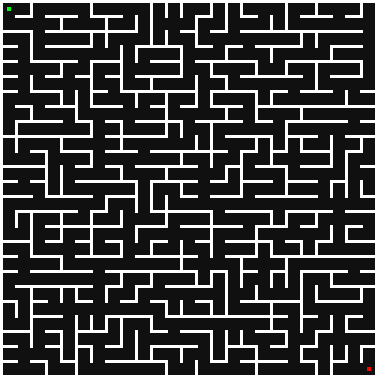
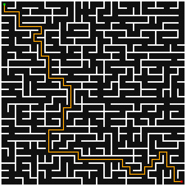

# Project for C++ (Maze Generator/Solver API/CLI)

## Project Theme
The project will focus on generating and solving mazes. It will be divided into two parts for processing. 
The first part will be more focused on logic, which will be an API/CLI written in C++. 
This API or CLI will accept user input data and create and solve mazes based on the parameters. 
The second part of the project will focus more on graphics in Python. 
The graphical GUI will serve as the interface for the API and will also be used in the URO subject.

## Logical Part of the Project (API/CLI)
This part will operate the following functions:
 - Creating a maze using a specified algorithm
   - Saving to a file or image
 - Solving a maze using a specified algorithm
   - Loading input from a file
   - Saving to a file or image
 - Finding the fastest algorithm for solving a maze
   - Outputting a table of results
 - Listing all available algorithms

## Graphical Part of the Project (GUI)
The graphical part of the project, written in Python, will use the tkinter library and 
libraries from the first part of the project to connect user interfaces with graphics. 
The application will send requests to the API and render their outputs on the screen.

## API Architecture
Important classes for work:
 - Maze (Class for storing a maze)
 - Algorithm (Class for utilizing an algorithm)
   - GeneratingAlgorithm (Subclass for generating algorithms)
   - SolvingAlgorithm (Subclass for solving algorithms)
 - Graph (Class for storing maze content)
   - Node (Subclass for storing maze cell)
 - Image (Class for exporting maze to an image)
 - Interface (Class for storing the interface)


## API Usage
```c++
void example() {
    // Creation of a maze
    MazeBuilder mazeBuilderGenerated = KruskalAlgorithm(time(nullptr)).generate(10,10);
    mazeBuilderGenerated.setStart({0,0});
    mazeBuilderGenerated.setEnd({mazeBuilderGenerated.getWidth() - 1,mazeBuilderGenerated.getHeight() - 1});
    mazeBuilderGenerated.setPathWidth(30);
    mazeBuilderGenerated.setWallWidth(3);

    // Building the maze
    Maze mazeGenerated = mazeBuilderGenerated.build();

    // Exporting the maze to a file
    TextFileSavingMethod().save(mazeGenerated,"maze.txt");

    // Exporting the maze to an image
    ImageSavingMethod().save(mazeGenerated,"maze.png");

    // Loading a maze from a file
    Expected<MazeBuilder> mazeBuilderLoaded = TextFileLoadingMethod().load("maze.txt");

    // Checking for errors
    if (mazeBuilderLoaded.hasError()) {
        cout << "Error: " << mazeBuilderLoaded.error() << endl;
        return 1;
    }

    // Solving the maze
    MazePath generatedPath = DepthFirstSearchAlgorithm().solve(mazeGenerated);

    // Exporting the maze to a file with the path
    TextFileSavingMethod().save(mazeGenerated,"mazePath.txt",generatedPath);

    // Exporting the maze to an image with the path
    ImageSavingMethod().save(mazeGenerated,"mazePath.png",generatedPath);
}
```

## Requirements:
- C++17
- CMake 3.22.1+
- Python 3.9.7+ (for GUI)

## Installation
```shell
# Clone the repository
git clone git@github.com:Firestone82/MazeLib.git
cd MazeLib

# Building as C++ CLI
mkdir build && cd build

# Build the project
cmake .. && make -j

# Build the project
pip install -r ../requirements.txt && pip install ..
```

## Images
Example maze output:




## CLI Usage
<details>
<summary>Click to show help CLI</summary>

```
 __  __               _      _ _
|  \/  |             | |    (_) |
| \  / | __ _ _______| |     _| |__
| |\/| |/ _` |_  / _ \ |    | | '_ \
| |  | | (_| |/ /  __/ |____| | |_) |
|_|  |_|\__,_/___\___|______|_|_.__/
Author: Pavel Mikula (MIK0486)

Format: mazelib <cmd> [options]

Commands:
  help                           | Show program help message (this)
  version, ver                   | Show programs version number
  generate, gen                  | Generate maze to file or image
  solve                          | Solve maze from file or image
  test                           | Test algorithms
  algorithms, algs, algos        | Show available algorithms

Options:
  -h, --help      | Show this help message and exit          | [boolean]
  -v, --version   | Show programs version number and exit    | [boolean]
```
</details>

<details>
<summary>Click to show generate CLI</summary>

```
Command: mazelib generate [options]

Options:
  -w, --width           | Width of maze                                     REQUIRED | [int]
  -h, --height          | Height of maze                                    REQUIRED | [int]
  -a, --algorithm       | Algorithm to generate maze                        REQUIRED | [string]
  -se, --seed           | Seed of the maze                                           | [double]
  -s, --start           | Start position of maze                                     | [int] [int]
  -e, --end             | End position of maze                                       | [int] [int]
  -pw, --pathWidth      | Width of the path between walls                            | [int]
  -ww, --wallWidth      | Width of wall between paths                                | [int]
  -f, --file            | Path to the file, where maze will be saved                 | [string]
  -i, --image           | Path to the image, where maze will be saved                | [string]
```
</details>

<details>
<summary>Click to show solve CLI</summary>

```
Command: mazelib solve [options]

Options:
  -fi, --fileIn         | Path to the input file of maze                    REQUIRED | [string]
  -a, --algorithm       | Algorithm to solve maze                           REQUIRED | [string]
  -s, --start           | Start position of maze                                     | [int] [int]
  -e, --end             | End position of maze                                       | [int] [int]
  -fo, --fileOut        | Path to the file, where maze will be saved                 | [string]
  -i, --image           | Path to the image, where maze will be saved                | [string]
```
</details>

<details>
<summary>Click to show test CLI</summary>

```
Command: mazelib test [options]

Options:
  -fi, --fileIn         | Path to the file, from which maze will be loaded  REQUIRED | [string]
  -a, --algorithm       | Algorithms to test, separated by commas                    | [string]
  -fo, --fileOut        | Path to the file, where maze will be saved                 | [string]
  -t, --table           | Output results printed in table                            |
```
</details>

<details>
<summary>Click to show algorithms CLI</summary>

```
Command: mazelib algorithms

Options:
  -o, --order           | Order of algorithms                                        | [string]
  -t, --type            | Type of algorithms                                         | [string]
  -d, --description     | Hide description of algorithms                             |
```
</details>

---
### Autor projektu: Pavel Mikula (MIK0486)
- Took approximately 77 hours
