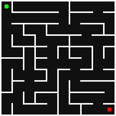
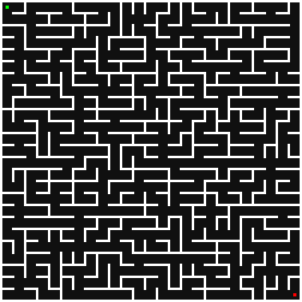
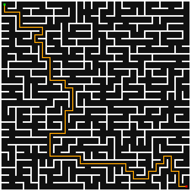
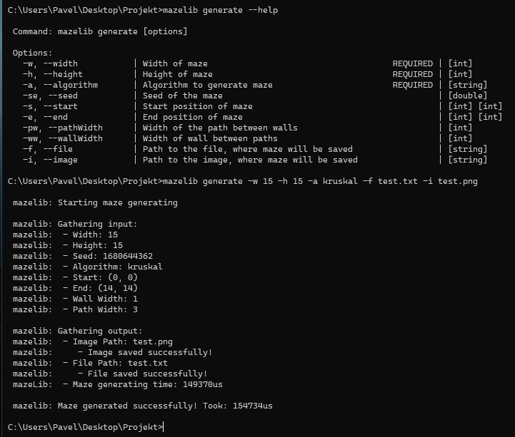
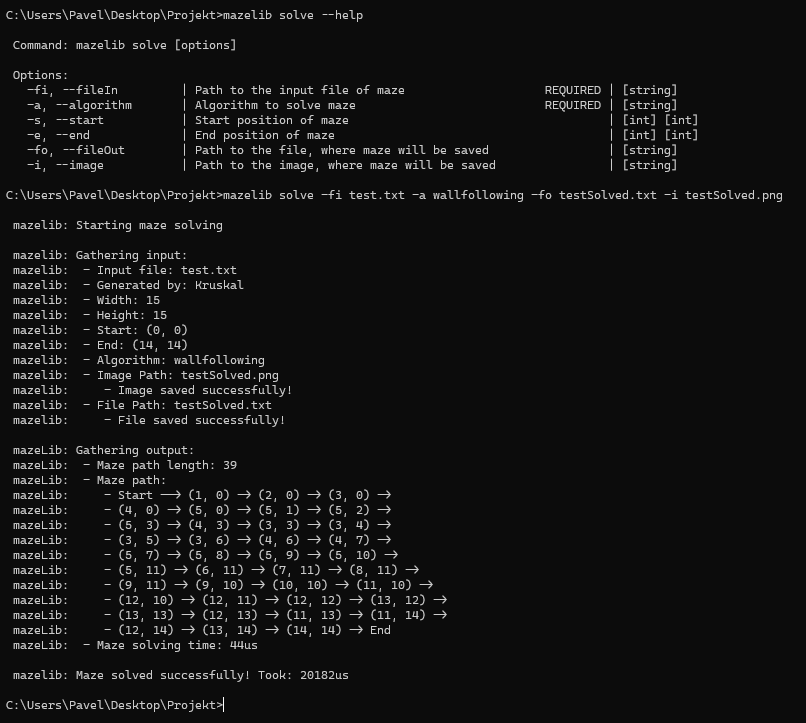
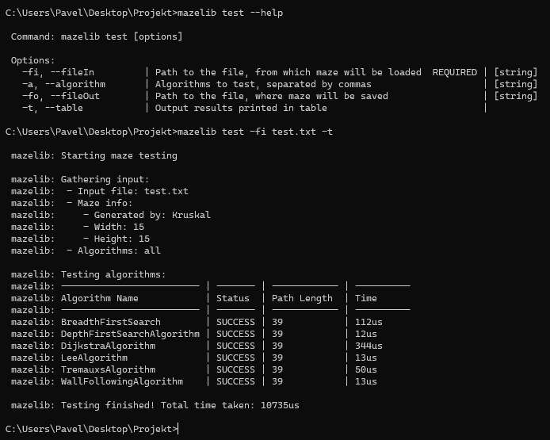
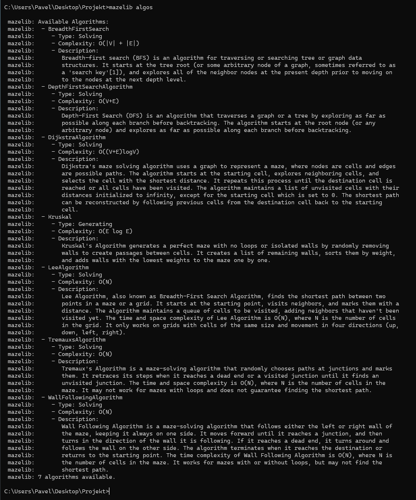

# MazeLib

> **VŠB-TUO** — School project · Programming in C++

<p>
  
  
  
</p>

A C++ maze generation and solving library with a CLI, programmatic API, and Python bindings. Mazes can be exported as PNG images or serialized to disk. Powers the companion [MazeLib-GUI](https://github.com/Firestone82/MazeLib-GUI) tkinter application.

<p align="center">
  
  &nbsp;&nbsp;&nbsp;
  
</p>

## Features

**Generation algorithms:** Depth-first search (recursive backtracker), Kruskal's

**Solving algorithms:** BFS, DFS, Dijkstra, Lee, Tremaux, Wall-following

**Output:** PNG image export, binary file serialization

**Interfaces:** CLI, C++ API, Python bindings

## Requirements

- C++17 compiler and CMake 3.22.1+
- Python 3.9+ and pip *(for bindings and GUI)*

## Setup

1. Clone the repository:
   ```bash
   git clone https://github.com/Firestone82/MazeLib.git
   cd MazeLib
   ```

2. Build the C++ library and CLI:
   ```bash
   mkdir build && cd build
   cmake .. && make -j$(nproc)
   cd ..
   ```

3. *(Optional)* Install Python bindings (required for MazeLib-GUI):
   ```bash
   pip install -r requirements.txt && pip install .
   ```

## CLI Usage

<details open>
<summary>General help</summary>

```
Format: mazelib <cmd> [options]

Commands:
  generate, gen    Generate a maze to file or image
  solve            Solve a maze from file or image
  test             Benchmark algorithms
  algorithms       List available algorithms
```
</details>

<details>
<summary>generate</summary>

```
Options:
  -w, --width       Width of maze                  REQUIRED
  -h, --height      Height of maze                 REQUIRED
  -a, --algorithm   Generation algorithm           REQUIRED
  -se, --seed       Seed for reproducible mazes
  -s, --start       Start position  [int] [int]
  -e, --end         End position    [int] [int]
  -pw, --pathWidth  Path width between walls
  -ww, --wallWidth  Wall width between paths
  -f, --file        Output file path
  -i, --image       Output image path
```
</details>

<details>
<summary>solve</summary>

```
Options:
  -fi, --fileIn     Input maze file path           REQUIRED
  -a, --algorithm   Solving algorithm              REQUIRED
  -s, --start       Start position
  -e, --end         End position
  -fo, --fileOut    Output file path
  -i, --image       Output image path
```
</details>

<details>
<summary>test</summary>

```
Options:
  -fi, --fileIn     Maze file to benchmark         REQUIRED
  -a, --algorithm   Algorithms to test (comma-sep)
  -fo, --fileOut    Output file path
  -t, --table       Print results as table
```
</details>

<p align="center">
  
  &nbsp;
  
</p>
<p align="center">
  
  &nbsp;
  
</p>

## API Usage

```cpp
// Generate a maze
MazeBuilder builder = KruskalAlgorithm(time(nullptr)).generate(10, 10);
builder.setPathWidth(30);
builder.setWallWidth(3);
Maze maze = builder.build();

// Export to file and image
TextFileSavingMethod().save(maze, "maze.txt");
ImageSavingMethod().save(maze, "maze.png");

// Load a saved maze
Expected<MazeBuilder> loaded = TextFileLoadingMethod().load("maze.txt");
if (loaded.hasError()) {
    cout << "Error: " << loaded.error() << endl;
    return;
}
maze = loaded.value().build();

// Solve and export with path
MazePath path = DepthFirstSearchAlgorithm().solve(maze);
ImageSavingMethod().save(maze, "mazePath.png", path);
```

## License

This project was created as a school assignment at VŠB-TUO.
